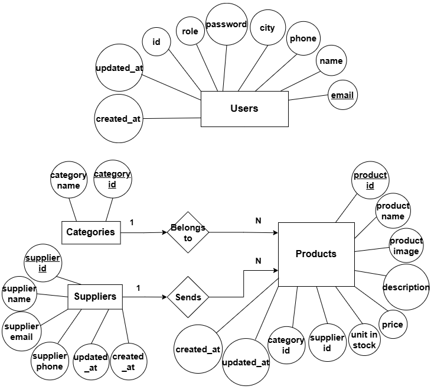

# 📦 TechStock - Inventory Management System

TechStock is a comprehensive inventory management system designed to track and manage stock. It is built as a full-stack web application with a Node.js/Express backend and a React (Vite) frontend.

## ✨ Features

- **🔐 Authentication** - Secure login and registration system using encrypted passwords.
- **📦 Inventory Management** - Full CRUD operations for inventory items, including image uploads.
- **📊 Inventory Tracking** - Real time monitoring of stock levels and product details.
- **🗂️ Category Management** - Organize products by categories (Laptops, Keyboards, Monitors, etc.).
- **🚚 Supplier Management** - Manage contact information for hardware providers.
- **📱 Responsive Design** - Built with a modern UI that works across various devices.

## 🛠️ Tech Stack

### 🎨 Frontend

- **Framework** - React (built with Vite)
- **Routing** - React Router DOM
- **HTTP Client** - Axios for API communication
- **Icons** - React Icons

### ⚙️ Backend

- **Environment** - Node.js
- **Framework** - Express.js
- **Database** - MySQL (via `mysql2`)
- **Authentication/Security** - Bcrypt & Express Session
- **File Uploads** - Multer (for image uploads)
- **Middleware** - CORS

## 📁 Project Structure

```text
techstock-node-react/
├── backend/            # Express.js Server
│   ├── auth/           # Authentication logic
│   ├── routes/         # API Endpoints
│   ├── uploads/        # Stored product images
│   └── app.js          # Entry point
├── frontend/           # React Application
│   ├── src/            # Components, Pages, Assets
│   └── public/         # Static files
└── techStock.sql       # Database schema dump
```

## 📊 Database Architecture (ERD)

Below is the Entity Relationship Diagram (ERD) used in this project, illustrating the connections between Products, Categories, Suppliers, and Users.



## ⚙️ Installation & Setup

### 📦 Prerequisites

- [Node.js](https://nodejs.org/) installed
- [MySQL Server](https://www.mysql.com/) installed and running (e.g., via XAMPP)

### 1. 🗄️ Database Setup

1. Make sure you have a MySQL server running.
2. Create a database named `techstock`.
3. Import the `techStock.sql` file provided in the root directory.
4. Configure your database connection in `backend/dbSingleton.js` (if necessary) with your MySQL user credentials.

### 2. ⚙️ Backend Setup

1. Navigate to the backend directory:
   ```bash
   cd backend
   ```
2. Install the dependencies:
   ```bash
   npm install
   ```
3. Start the backend development server:
   ```bash
   # nodemon app.js (for auto-reloading)
   npm run dev
   ```
   _The backend runs on `http://localhost:3000`._

### 3. 🎨 Frontend Setup

1. Open a new terminal and navigate to the frontend directory:
   ```bash
   cd frontend
   ```
2. Install the dependencies:
   ```bash
   npm install
   ```
3. Start the React development server:
   ```bash
   npm start
   ```
   _The application will be accessible at `http://localhost:5173`._

## 🔐 Default Test Accounts

For demonstration purposes, you can use the following accounts to explore the system::

| Email              | Password   |
| :----------------- | :--------- |
| `bshara@gmail.com` | `bshara1`  |
| `joker@gmail.com`  | `joker123` |
| `batman@gmail.com` | `batman12` |

---

<p align="center">
  • TechStock - Inventory System •<br>
  Made with ❤️ using React + Vite
</p>
